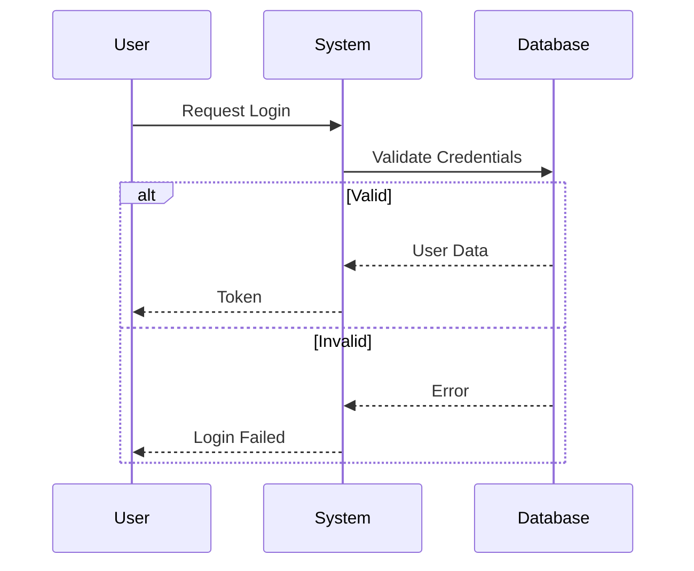
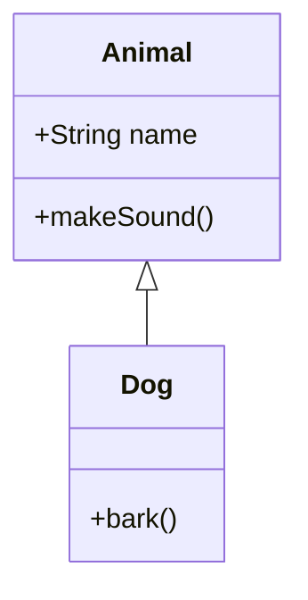

# Auto-Mermaid Architect

## Purpose
To quickly visualize existing code or proposed designs using Mermaid.js diagrams. This helps in understanding complex call chains, class relationships, and state transitions.

## Instructions for the Agent

**Trigger**: When the user requests a "diagram", "architecture view", "visualization", or explicitly asks for "Mermaid" code.

### 1. Analysis Phase
*   **Identify the Scope**: specific file, feature, or entire module?
*   **Identify Type**:
    *   **Class Diagram**: For structure, inheritance, interfaces.
    *   **Sequence Diagram**: For logic flow, function calls, interactions between objects.
    *   **State Diagram**: For state machines (e.g., GameStatus, OrderState).
    *   **Flowchart**: For decision trees or simple algorithms.
    *   **ER Diagram**: For database schemas and relationships.
*   **Proactivity**: Do not wait for specific requests. If you see complex logic, state machines, or data structures, proactively propose or generate diagrams.

### 2. Generation Rules
*   **Location**: You **MUST** save all generated Mermaid diagrams to the `[ProjectRoot]/img_ai_gen/architecture/` directory. Create the directory if it doesn't exist.
*   **Naming**: Use descriptive filenames, e.g., `game_engine_state_diagram.mmd`.
*   **Syntax**: Use standard Mermaid syntax.
*   **Cleanliness**:
    *   Use clear aliases for participants (e.g., `participant U as User`).
    *   Group related classes using `namespace` or `subgraph` if helpful.
    *   Avoid over-cluttering; focus on the *core* logic/structure requested.
*   **Output Format**: Always wrap the output in a markdown code block labeled `mermaid`.

### 3. Examples

**Sequence Diagram**:

**Class Diagram**:

