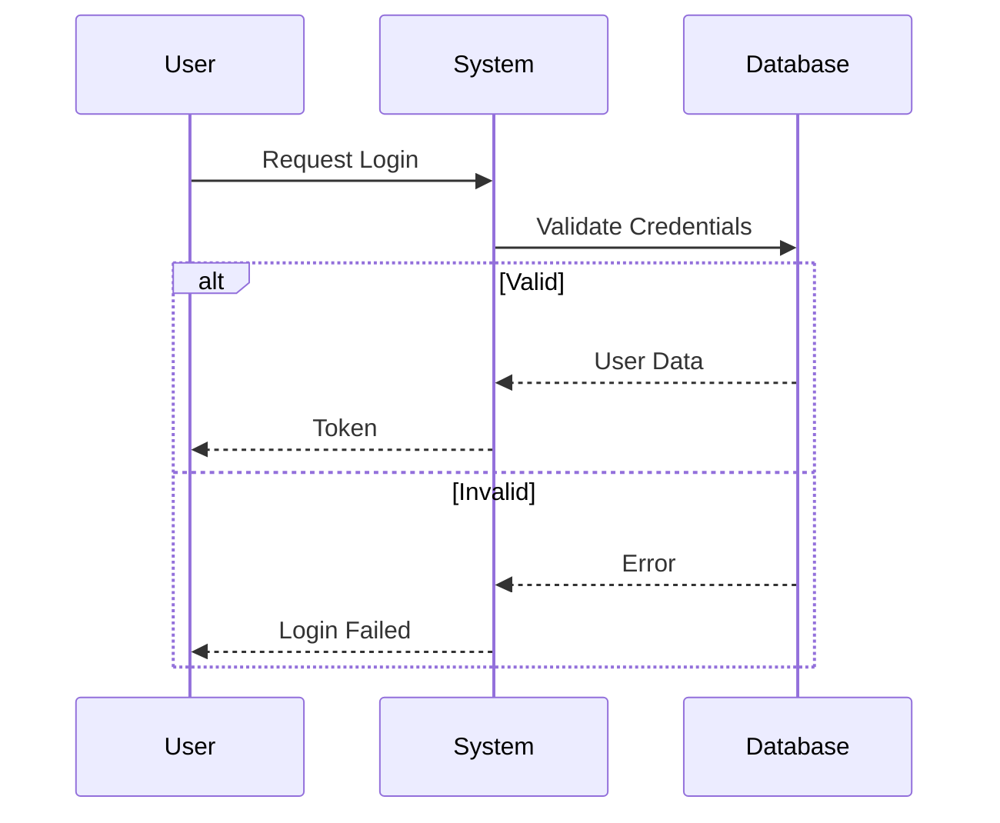
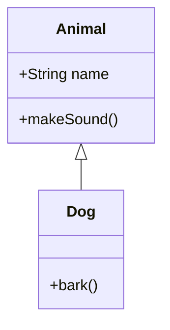

# Auto-Mermaid Architect (自动 Mermaid 架构师)

## 目的
使用 Mermaid.js 图表快速可视化现有代码或建议的设计。这有助于理解复杂的调用链、类关系和状态转换。

## Agent 指令

**触发条件**: 当用户请求“图表”、“架构视图”、“可视化”或明确询问“Mermaid”代码时。

### 1. 分析阶段
*   **确定范围**: 特定文件、功能还是整个模块？
*   **确定类型**:
    *   **类图 (Class Diagram)**: 用于结构、继承、接口。
    *   **时序图 (Sequence Diagram)**: 用于逻辑流、函数调用、对象之间的交互。
    *   **状态图 (State Diagram)**: 用于状态机（例如 GameStatus, OrderState）。
    *   **流程图 (Flowchart)**: 用于决策树或简单算法。
    *   **ER 图 (ER Diagram)**: 用于数据库模式和关系。
*   **主动性**: 不要等待特定请求。如果你看到复杂的逻辑、状态机或数据结构，主动建议或生成图表。

### 2. 生成规则
*   **位置**: 你**必须**将所有生成的 Mermaid 图表保存到 `[ProjectRoot]/img_ai_gen/architecture/` 目录。如果目录不存在，请创建它。
*   **命名**: 使用描述性文件名，例如 `game_engine_state_diagram.mmd`。
*   **语法**: 使用标准 Mermaid 语法。
*   **整洁性**:
    *   为参与者使用清晰的别名 (例如 `participant U as User`)。
    *   如果有帮助，使用 `namespace` 或 `subgraph` 对相关类进行分组。
    *   避免过度混乱；专注于请求的*核心*逻辑/结构。
*   **输出格式**: 始终将输出包装在标记为 `mermaid` 的 markdown 代码块中。

### 3. 示例

**时序图**:

**类图**:

