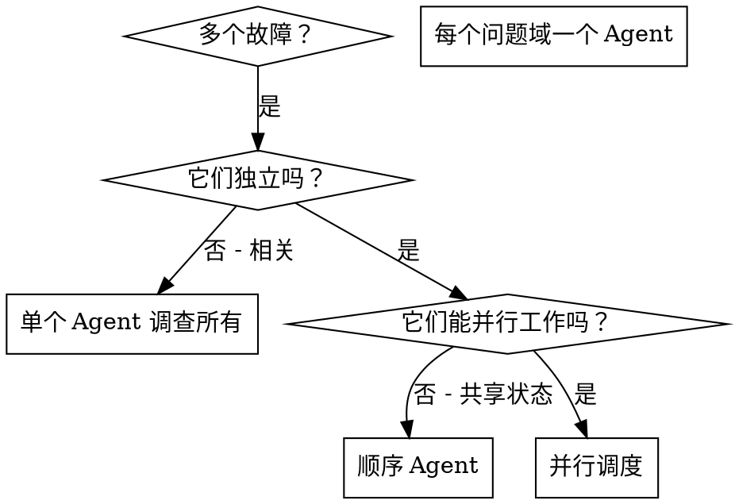

# 调度并行 Agent

## 概述

当你有多个无关的故障（不同的测试文件、不同的子系统、不同的错误）时，按顺序调查它们会浪费时间。每个调查都是独立的，可以并行发生。

**核心原则：** 每个独立问题域调度一个 Agent。让它们并发工作。

## 何时使用



**使用场景：**
- 3+ 个测试文件失败，根本原因不同
- 多个子系统独立损坏
- 每个问题都可以在没有其他上下文的情况下被理解
- 调查之间没有共享状态

**不要在以下情况使用：**
- 故障是相关的（修复一个可能会修复其他）
- 需要了解完整的系统状态
- Agent 会互相干扰

## 模式

### 1. 识别独立领域

按损坏的内容对故障进行分组：
- 文件 A 测试：工具批准流程
- 文件 B 测试：批量完成行为
- 文件 C 测试：中止功能

每个领域都是独立的 - 修复工具批准不会影响中止测试。

### 2. 创建专注的 Agent 任务

每个 Agent 获得：
- **特定范围：** 一个测试文件或子系统
- **明确目标：** 使这些测试通过
- **约束：** 不要更改其他代码
- **预期输出：** 你发现和修复内容的总结

### 3. 并行调度

```typescript
//在 Claude Code / AI 环境中
Task("修复 agent-tool-abort.test.ts 故障")
Task("修复 batch-completion-behavior.test.ts 故障")
Task("修复 tool-approval-race-conditions.test.ts 故障")
// 所有三个并发运行
```

### 4. 审查和集成

当 Agent 返回时：
- 阅读每个总结
- 验证修复不冲突
- 运行完整的测试套件
- 集成所有更改

## Agent 提示结构

好的 Agent 提示是：
1. **专注** - 一个明确的问题域
2. **自包含** - 理解问题所需的所有上下文
3. **关于输出具体** - Agent 应该返回什么？

```markdown
修复 src/agents/agent-tool-abort.test.ts 中的 3 个失败测试：

1. "should abort tool with partial output capture" - 期望消息中有 'interrupted at'
2. "should handle mixed completed and aborted tools" - 快速工具中止而不是完成
3. "should properly track pendingToolCount" - 期望 3 个结果但得到 0 个

这些是计时/竞争条件问题。你的任务：

1. 阅读测试文件并了解每个测试验证的内容
2. 识别根本原因 - 计时问题还是实际错误？
3. 修复方法：
   - 用基于事件的等待替换任意超时
   - 如果发现中止实现中的错误，请进行修复
   - 如果测试改变了行为，请调整测试预期

不要只是增加超时 - 找到真正的问题。

返回：你发现的内容和你修复的内容的总结。
```

## 常见错误

**❌ 太宽泛：** "修复所有测试" - Agent 会迷失方向
**✅ 具体：** "修复 agent-tool-abort.test.ts" - 专注范围

**❌ 无上下文：** "修复竞争条件" - Agent 不知道在哪里
**✅ 上下文：** 粘贴错误消息和测试名称

**❌ 无约束：** Agent 可能会重构所有内容
**✅ 约束：** "不要更改生产代码" 或 "仅修复测试"

**❌ 模糊输出：** "修复它" - 你不知道改变了什么
**✅ 具体：** "返回根本原因和更改的总结"

## 何时不使用

**相关故障：** 修复一个可能会修复其他 - 首先一起调查
**需要完整上下文：** 理解需要查看整个系统
**探索性调试：** 你还不知道什么坏了
**共享状态：** Agent 会互相干扰（编辑相同的文件，使用相同的资源）

## 会话中的真实示例

**场景：** 重大重构后 3 个文件中有 6 个测试失败

**故障：**
- agent-tool-abort.test.ts: 3 个失败（计时问题）
- batch-completion-behavior.test.ts: 2 个失败（工具未执行）
- tool-approval-race-conditions.test.ts: 1 个失败（执行计数 = 0）

**决策：** 独立领域 - 中止逻辑与批量完成分离，与竞争条件分离

**调度：**
```
Agent 1 → 修复 agent-tool-abort.test.ts
Agent 2 → 修复 batch-completion-behavior.test.ts
Agent 3 → 修复 tool-approval-race-conditions.test.ts
```

**结果：**
- Agent 1: 用基于事件的等待替换超时
- Agent 2: 修复了事件结构错误（threadId 位置错误）
- Agent 3: 添加了等待异步工具执行完成

**集成：** 所有修复独立，无冲突，全套测试通过

**节省时间：** 3 个问题并行解决 vs 顺序解决

## 主要好处

1. **并行化** - 多个调查同时发生
2. **专注** - 每个 Agent 范围狭窄，需要跟踪的上下文更少
3. **独立** - Agent 互不干扰
4. **速度** - 用解决 1 个问题的时间解决 3 个问题

## 验证

Agent 返回后：
1. **审查每个总结** - 了解更改了什么
2. **检查冲突** - Agent 是否编辑了相同的代码？
3. **运行完整套件** - 验证所有修复协同工作
4. **抽查** - Agent 可能会犯系统性错误

## 真实世界影响

来自调试会话（2025-10-03）：
- 3 个文件中有 6 个失败
- 并行调度了 3 个 Agent
- 所有调查并发完成
- 所有修复成功集成
- Agent 更改之间零冲突
