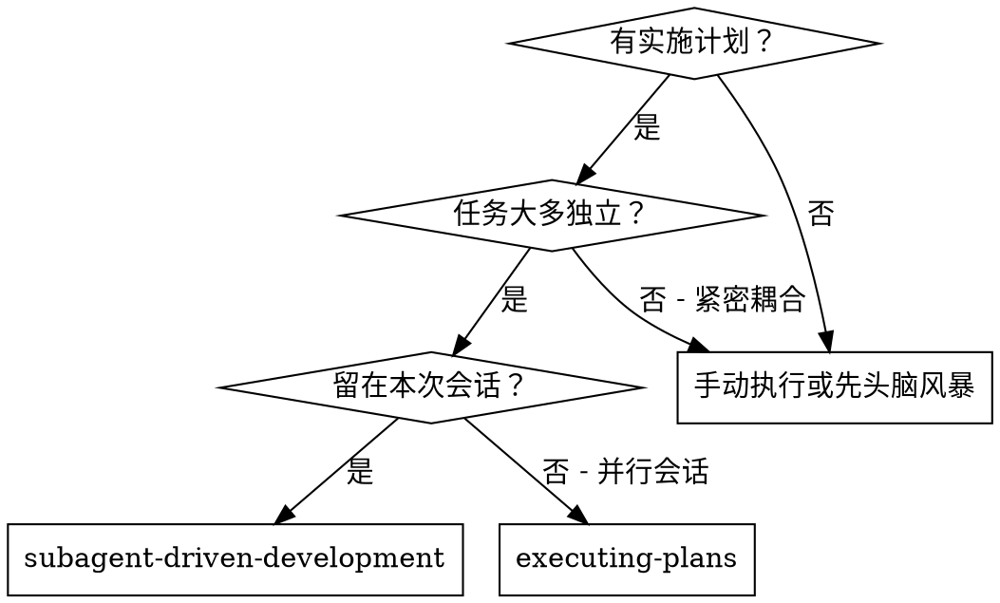
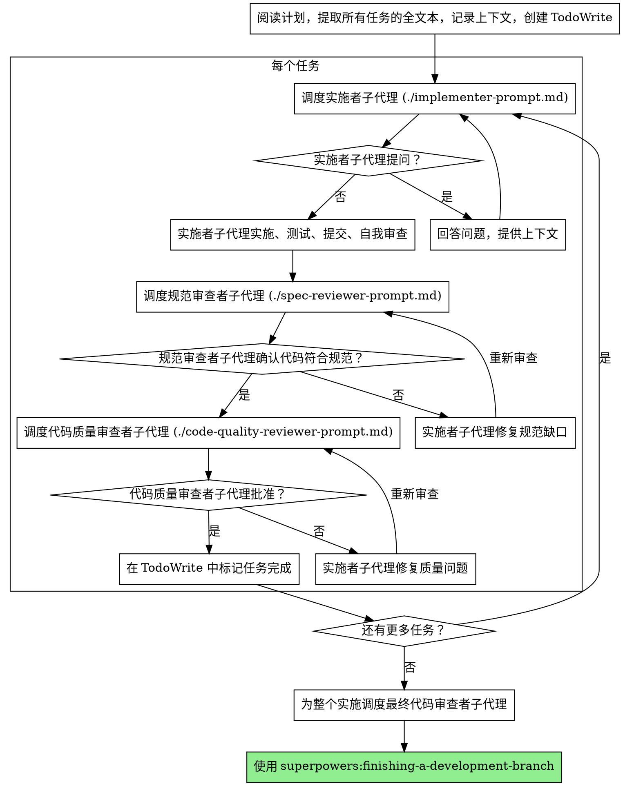

# 子代理驱动开发

通过每个任务调度一个新的子代理（subagent）来执行计划，并在每个任务之后进行两阶段审查：首先是规范合规性审查，然后是代码质量审查。

**核心原则：** 每个任务一个新的子代理 + 两阶段审查（先规范后质量）= 高质量，快速迭代

## 何时使用



**对比 Executing Plans（并行会话）：**
- 同一会话（无上下文切换）
- 每个任务一个新的子代理（无上下文污染）
- 每个任务后两阶段审查：先规范合规性，后代码质量
- 更快的迭代（任务之间无需人在回路）

## 流程



## 提示模板

- `./implementer-prompt.md` - 调度实施者子代理
- `./spec-reviewer-prompt.md` - 调度规范合规性审查者子代理
- `./code-quality-reviewer-prompt.md` - 调度代码质量审查者子代理

## 示例工作流

```
你：我正在使用 Subagent-Driven Development 来执行这个计划。

[阅读一次计划文件：docs/plans/feature-plan.md]
[提取所有 5 个任务的全文本和上下文]
[创建包含所有任务的 TodoWrite]

任务 1：Hook 安装脚本

[获取任务 1 文本和上下文（已提取）]
[调度实施子代理，带有完整的任务文本 + 上下文]

实施者："在开始之前 - hook 应该安装在用户级还是系统级？"

你："用户级 (~/.config/superpowers/hooks/)"

实施者："明白了。现在开始实施..."
[后来] 实施者：
  - 实施了 install-hook 命令
  - 添加了测试，5/5 通过
  - 自我审查：发现我漏掉了 --force 标志，已添加
  - 已提交

[调度规范合规性审查者]
规范审查者：✅ 符合规范 - 满足所有要求，没有多余内容

[获取 git SHA，调度代码质量审查者]
代码审查者：优势：测试覆盖率好，整洁。问题：无。批准。

[标记任务 1 完成]

任务 2：恢复模式

[获取任务 2 文本和上下文（已提取）]
[调度实施子代理，带有完整的任务文本 + 上下文]

实施者：[无问题，继续]
实施者：
  - 添加了 verify/repair 模式
  - 8/8 测试通过
  - 自我审查：一切良好
  - 已提交

[调度规范合规性审查者]
规范审查者：❌ 问题：
  - 缺失：进度报告（规范说“每 100 项报告一次”）
  - 多余：添加了 --json 标志（未请求）

[实施者修复问题]
实施者：移除了 --json 标志，添加了进度报告

[规范审查者再次审查]
规范审查者：✅ 现在符合规范了

[调度代码质量审查者]
代码审查者：优势：稳固。问题（重要）：魔法数字 (100)

[实施者修复]
实施者：提取了 PROGRESS_INTERVAL 常量

[代码审查者再次审查]
代码审查者：✅ 批准

[标记任务 2 完成]

...

[所有任务之后]
[调度最终代码审查者]
最终审查者：所有要求满足，准备合并

完成！
```

## 优势

**对比手动执行：**
- 子代理自然遵循 TDD
- 每个任务新鲜的上下文（无混淆）
- 并行安全（子代理不干扰）
- 子代理可以提问（工作前和工作中）

**对比 Executing Plans：**
- 同一会话（无交接）
- 持续进展（无等待）
- 自动审查检查点

**效率提升：**
- 无文件读取开销（控制器提供全文本）
- 控制器只策划所需的上下文
- 子代理预先获得完整信息
- 问题在工作开始前浮出水面（而不是之后）

**质量门控：**
- 自我审查在交接前提早发现问题
- 两阶段审查：规范合规性，然后代码质量
- 审查循环确保修复实际有效
- 规范合规性防止过度/不足构建
- 代码质量确保实施构建良好

**成本：**
- 更多子代理调用（实施者 + 每个任务 2 个审查者）
- 控制器做更多准备工作（预先提取所有任务）
- 审查循环增加迭代
- 但提早发现问题（比以后调试更便宜）

## 危险信号

**绝不：**
- 跳过审查（规范合规性或代码质量）
- 在未修复问题的情况下继续
- 并行调度多个实施子代理（冲突）
- 让子代理阅读计划文件（提供全文本代替）
- 跳过场景设置上下文（子代理需要了解任务的适用位置）
- 忽略子代理问题（在让他们继续之前回答）
- 在规范合规性上接受“足够接近”（规范审查者发现问题 = 未完成）
- 跳过审查循环（审查者发现问题 = 实施者修复 = 再次审查）
- 让实施者自我审查取代实际审查（两者都需要）
- **在规范合规性 ✅ 之前开始代码质量审查**（顺序错误）
- 当任何审查有未解决问题时移动到下一个任务

**如果子代理提问：**
- 清楚完整地回答
- 如果需要，提供额外的上下文
- 不要催促他们进入实施

**如果审查者发现问题：**
- 实施者（同一个子代理）修复它们
- 审查者再次审查
- 重复直到批准
- 不要跳过重新审查

**如果子代理任务失败：**
- 调度修复子代理，带有具体指令
- 不要尝试手动修复（上下文污染）

## 集成

**必需的工作流技能：**
- **superpowers:writing-plans** - 创建此技能执行的计划
- **superpowers:requesting-code-review** - 审查者子代理的代码审查模板
- **superpowers:finishing-a-development-branch** - 所有任务之后完成开发

**子代理应该使用：**
- **superpowers:test-driven-development** - 子代理为每个任务遵循 TDD

**替代工作流：**
- **superpowers:executing-plans** - 用于并行会话而不是同会话执行
