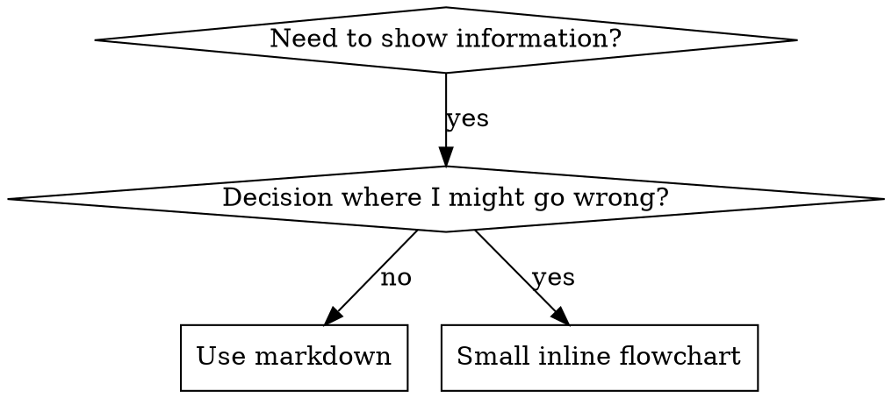

# 编写技能

## 概述

**编写技能就是应用于流程文档的测试驱动开发。**

**个人技能位于特定于 agent 的目录中（Claude Code 为 `~/.claude/skills`，Codex 为 `~/.codex/skills`）**

你编写测试用例（使用子代理的压力场景），看着它们失败（基线行为），编写技能（文档），看着测试通过（agent 遵守），并重构（堵塞漏洞）。

**核心原则：** 如果你没有看着一个 agent 在没有技能的情况下失败，你就不知道技能是否教导了正确的东西。

**必须的背景知识：** 在使用此技能之前，你必须了解 superpowers:test-driven-development。该技能定义了基本的 红-绿-重构 循环。此技能将 TDD 调整用于文档。

**官方指导：** 有关 Anthropic 的官方技能创作最佳实践，请参阅 anthropic-best-practices.md。该文档提供了补充本技能中以 TDD 为中心的方法的额外模式和指南。

## 什么是技能？

**技能**是经过验证的技术、模式或工具的参考指南。技能帮助未来的 Claude 实例找到并应用有效的方法。

**技能是：** 可重用的技术、模式、工具、参考指南

**技能不是：** 关于你曾经如何解决问题的叙述

## 技能的 TDD 映射

| TDD 概念 | 技能创建 |
|-------------|----------------|
| **测试用例** | 使用子代理（subagent）的压力场景 |
| **生产代码** | 技能文档 (SKILL.md) |
| **测试失败 (红)** | Agent 在没有技能的情况下违反规则（基线） |
| **测试通过 (绿)** | Agent 在有技能的情况下遵守规则 |
| **重构** | 在保持合规的同时堵塞漏洞 |
| **先写测试** | 在编写技能之前运行基线场景 |
| **看着它失败** | 记录 agent 使用的确切理由 |
| **最少代码** | 编写解决这些特定违规的技能 |
| **看着它通过** | 验证 agent 现在遵守 |
| **重构循环** | 找到新的理由 → 堵塞 → 重新验证 |

整个技能创建过程遵循 红-绿-重构。

## 何时创建技能

**在以下情况创建：**
- 技术对你来说并不直观
- 你会在跨项目中再次引用这个
- 模式广泛适用（不是特定于项目的）
- 其他人会受益

**不要为以下情况创建：**
- 一次性解决方案
- 在其他地方有详细记录的标准做法
- 特定于项目的约定（放入 CLAUDE.md）
- 机械约束（如果可以用 regex/验证强制执行，自动化它——将文档留给判断调用）

## 技能类型

### 技术
带有遵循步骤的具体方法（condition-based-waiting, root-cause-tracing）

### 模式
思考问题的方式（flatten-with-flags, test-invariants）

### 参考
API 文档，语法指南，工具文档（办公室文档）

## 目录结构

```
skills/
  skill-name/
    SKILL.md              # 主要参考（必需）
    supporting-file.*     # 仅在需要时
```

**扁平命名空间** - 所有技能在一个可搜索的命名空间中

**单独的文件用于：**
1. **重型参考**（100+ 行）- API 文档，综合语法
2. **可重用工具** - 脚本，实用程序，模板

**保持内联：**
- 原则和概念
- 代码模式（< 50 行）
- 其他所有内容

## SKILL.md 结构

**Frontmatter (YAML):**
- 仅支持两个字段：`name` 和 `description`
- 总共最多 1024 个字符
- `name`：仅使用字母、数字和连字符（无括号，特殊字符）
- `description`：第三人称，仅描述何时使用（**不是**它做什么）
  - 以“Use when...”开头以专注于触发条件
  - 包括具体症状、情况和上下文
  - **绝不要总结技能的过程或工作流**（见 CSO 部分了解原因）
  - 如果可能，保持在 500 个字符以下

```markdown
---
name: Skill-Name-With-Hyphens
description: Use when [具体触发条件和症状]
---

# Skill Name

## Overview
这是什么？用 1-2 句话概括核心原则。

## When to Use
[如果决定不明显，使用小内联流程图]

带有症状和用例的项目符号列表
何时不使用

## Core Pattern (用于技术/模式)
代码比较之前/之后

## Quick Reference
用于扫描常见操作的表格或项目符号

## Implementation
用于简单模式的内联代码
链接到重型参考或可重用工具的文件

## Common Mistakes
什么出错 + 修复

## Real-World Impact (可选)
具体结果
```


## Claude Search Optimization (CSO)

**对发现至关重要：** 未来的 Claude 需要**找到**你的技能

### 1. 丰富的描述字段

**目的：** Claude 阅读描述以决定为给定任务加载哪些技能。让它回答：“我现在应该读这个技能吗？”

**格式：** 以“Use when...”开头以专注于触发条件

**关键：描述 = 何时使用，不是技能做什么**

描述应该只描述触发条件。不要在描述中总结技能的过程或工作流。

**为什么这很重要：** 测试表明，当描述总结技能的工作流时，Claude 可能会遵循描述而不是阅读完整的技能内容。如果描述说“任务之间的代码审查”导致 Claude 做一次审查，即使技能的流程图清楚地显示两次审查（先规范合规性，然后代码质量）。

当描述更改为仅“在当前会话中执行具有独立任务的实施计划时使用”（无工作流总结）时，Claude 正确阅读了流程图并遵循了两阶段审查过程。

**陷阱：** 总结工作流的描述创建了 Claude 将采取的捷径。技能正文变成 Claude 跳过的文档。

```yaml
# ❌ 坏：总结工作流 - Claude 可能遵循这个而不是阅读技能
description: Use when executing plans - dispatches subagent per task with code review between tasks

# ❌ 坏：太多过程细节
description: Use for TDD - write test first, watch it fail, write minimal code, refactor

# ✅ 好：仅触发条件，无工作流总结
description: Use when executing implementation plans with independent tasks in the current session

# ✅ 好：仅触发条件
description: Use when implementing any feature or bugfix, before writing implementation code
```

**内容：**
- 使用具体的触发器、症状和情况，表明此技能适用
- 描述*问题*（竞争条件，不一致的行为）而不是*特定于语言的症状*（setTimeout, sleep）
- 保持触发器与技术无关，除非技能本身是特定于技术的
- 如果技能是特定于技术的，在触发器中明确说明
- 用第三人称写（注入到系统提示中）
- **绝不要总结技能的过程或工作流**

```yaml
# ❌ 坏：太抽象，模糊，不包括何时使用
description: For async testing

# ❌ 坏：第一人称
description: I can help you with async tests when they're flaky

# ❌ 坏：提及技术但技能不是特定于它的
description: Use when tests use setTimeout/sleep and are flaky

# ✅ 好：以 "Use when" 开头，描述问题，无工作流
description: Use when tests have race conditions, timing dependencies, or pass/fail inconsistently

# ✅ 好：带有明确触发器的特定于技术的技能
description: Use when using React Router and handling authentication redirects
```

### 2. 关键词覆盖

使用 Claude 会搜索的词：
- 错误消息："Hook timed out", "ENOTEMPTY", "race condition"
- 症状："flaky", "hanging", "zombie", "pollution"
- 同义词："timeout/hang/freeze", "cleanup/teardown/afterEach"
- 工具：实际命令，库名称，文件类型

### 3. 描述性命名

**使用主动语态，动词优先：**
- ✅ `creating-skills` 不是 `skill-creation`
- ✅ `condition-based-waiting` 不是 `async-test-helpers`

### 4. Token 效率（关键）

**问题：** getting-started 和经常引用的技能加载到每个对话中。每个 token 都有数。

**目标字数：**
- getting-started 工作流：每个 <150 个词
- 经常加载的技能：总共 <200 个词
- 其他技能：<500 个词（仍然要简洁）

**技术：**

**将细节移动到工具帮助：**
```bash
# ❌ 坏：在 SKILL.md 中记录所有标志
search-conversations supports --text, --both, --after DATE, --before DATE, --limit N

# ✅ 好：引用 --help
search-conversations supports multiple modes and filters. Run --help for details.
```

**使用交叉引用：**
```markdown
# ❌ 坏：重复工作流细节
When searching, dispatch subagent with template...
[20 lines of repeated instructions]

# ✅ 好：引用其他技能
Always use subagents (50-100x context savings). REQUIRED: Use [other-skill-name] for workflow.
```

**压缩示例：**
```markdown
# ❌ 坏：冗长的示例（42 个词）
your human partner: "How did we handle authentication errors in React Router before?"
You: I'll search past conversations for React Router authentication patterns.
[Dispatch subagent with search query: "React Router authentication error handling 401"]

# ✅ 好：最简示例（20 个词）
Partner: "How did we handle auth errors in React Router?"
You: Searching...
[Dispatch subagent → synthesis]
```

**消除冗余：**
- 不要重复交叉引用的技能中的内容
- 不要解释命令中显而易见的内容
- 不要包含同一模式的多个示例

**验证：**
```bash
wc -w skills/path/SKILL.md
# getting-started workflows: aim for <150 each
# Other frequently-loaded: aim for <200 total
```

**根据你做的或核心见解命名：**
- ✅ `condition-based-waiting` > `async-test-helpers`
- ✅ `using-skills` 不是 `skill-usage`
- ✅ `flatten-with-flags` > `data-structure-refactoring`
- ✅ `root-cause-tracing` > `debugging-techniques`

**动名词 (-ing) 适合过程：**
- `creating-skills`, `testing-skills`, `debugging-with-logs`
- 主动，描述你正在采取的行动

### 4. 交叉引用其他技能

**当编写引用其他技能的文档时：**

仅使用技能名称，带有显式的需求标记：
- ✅ 好：`**REQUIRED SUB-SKILL:** Use superpowers:test-driven-development`
- ✅ 好：`**REQUIRED BACKGROUND:** You MUST understand superpowers:systematic-debugging`
- ❌ 坏：`See skills/testing/test-driven-development`（不清楚是否必需）
- ❌ 坏：`@skills/testing/test-driven-development/SKILL.md`（强制加载，消耗上下文）

**为什么没有 @ 链接：** `@` 语法立即强制加载文件，在你需要它们之前消耗 200k+ 上下文。

## 流程图用法



**仅在以下情况使用流程图：**
- 不明显的决策点
- 可能过早停止的过程循环
- "何时使用 A vs B" 决策

**绝不要将流程图用于：**
- 参考材料 → 表格，列表
- 代码示例 → Markdown 块
- 线性指令 → 编号列表
- 没有语义意义的标签（step1, helper2）

参见 @graphviz-conventions.dot 了解 graphviz 样式规则。

**为你的人类伙伴可视化：** 使用此目录中的 `render-graphs.js` 将技能的流程图渲染为 SVG：
```bash
./render-graphs.js ../some-skill           # Each diagram separately
./render-graphs.js ../some-skill --combine # All diagrams in one SVG
```

## 代码示例

**一个优秀的示例胜过许多平庸的示例**

选择最相关的语言：
- 测试技术 → TypeScript/JavaScript
- 系统调试 → Shell/Python
- 数据处理 → Python

**好的示例：**
- 完整且可运行
- 解释原因的注释良好
- 来自真实场景
- 清楚地显示模式
- 准备好适应（不是通用模板）

**不要：**
- 用 5+ 种语言实施
- 创建填空模板
- 编写做作的示例

你擅长移植 - 一个很棒的示例就足够了。

## 文件组织

### 自包含技能
```
defense-in-depth/
  SKILL.md    # 亦切内联
```
当：所有内容都适合，不需要重型参考

### 带有可重用工具的技能
```
condition-based-waiting/
  SKILL.md    # 概览 + 模式
  example.ts  # 可适应的工作助手
```
当：工具是可重用的代码，而不仅仅是叙述

### 带有重型参考的技能
```
pptx/
  SKILL.md       # 概览 + 工作流
  pptxgenjs.md   # 600 行 API 参考
  ooxml.md       # 500 行 XML 结构
  scripts/       # 可执行工具
```
当：参考材料太大无法内联

## 铁律（与 TDD 相同）

```
没有先行的失败测试，就没有技能
```

这适用于**新**技能**和**对现有技能的**编辑**。

在测试之前写技能？删除它。重新开始。
在没有测试的情况下编辑技能？同样的违规。

**无例外：**
- 不适用于“简单添加”
- 不适用于“只是添加一个部分”
- 不适用于“文档更新”
- 不要保留未经测试的更改作为“参考”
- 不要在运行测试时“适应”
- 删除意味着删除

**必须的背景知识：** superpowers:test-driven-development 技能解释了为什么这很重要。同样的原则适用于文档。

## 测试所有技能类型

不同的技能类型需要不同的测试方法：

### 纪律强制技能（规则/要求）

**示例：** TDD, verification-before-completion, designing-before-coding

**测试方式：**
- 学术问题：它们理解规则吗？
- 压力场景：它们在压力下遵守吗？
- 结合多种压力：时间 + 沉没成本 + 疲惫
- 识别理由并添加明确的反制

**成功标准：** Agent 在最大压力下遵循规则

### 技术技能（操作指南）

**示例：** condition-based-waiting, root-cause-tracing, defensive-programming

**测试方式：**
- 应用场景：它们能正确应用该技术吗？
- 变体场景：它们能处理边缘情况吗？
- 缺失信息测试：指令是否有缺口？

**成功标准：** Agent 成功将技术应用于新场景

### 模式技能（心智模型）

**示例：** reducing-complexity, information-hiding concepts

**测试方式：**
- 识别场景：它们能识别模式何时适用？
- 应用场景：它们能使用心智模型吗？
- 反例：它们知道何时**不**应用吗？

**成功标准：** Agent 正确识别何时/如何应用模式

### 参考技能（文档/API）

**示例：** API 文档，命令参考，库指南

**测试方式：**
- 检索场景：它们能找到正确的信息吗？
- 应用场景：它们能正确使用发现的内容吗？
- 缺口测试：常见用例是否覆盖？

**成功标准：** Agent 找到并正确应用参考信息

## 跳过测试的常见借口

| 借口 | 现实 |
|--------|---------|
| “技能显然很清楚” | 对你清楚 ≠ 对其他 agent 清楚。测试它。 |
| “这只是一个参考” | 参考可能有缺口，不清楚的部分。测试检索。 |
| “测试是大材小用” | 未经测试的技能有问题。总是。15 分钟测试节省数小时。 |
| “如果有问题我会测试” | 问题 = agent 无法使用技能。在部署前测试。 |
| “测试太乏味” | 测试比在生产中调试糟糕的技能不那么乏味。 |
| “我有信心它很好” | 过度自信保证有问题。无论如何测试。 |
| “学术审查足够了” | 阅读 ≠ 使用。测试应用场景。 |
| “没时间测试” | 部署未经测试的技能会在以后修复它时浪费更多时间。 |

**所有这些意味着：在部署前测试。无例外。**

## 针对理由对技能进行防弹

强制执行纪律的技能（如 TDD）需要抵制合理化。Agent 很聪明，在压力下会找到漏洞。

**心理学注：** 理解为什么说服技术有效有助于你系统地应用它们。参见 persuasion-principles.md 以获取研究基础（Cialdini, 2021; Meincke et al., 2025）关于权威、承诺、稀缺性、社会证明和团结原则。

### 显式堵塞每个漏洞

不仅要陈述规则 - 禁止具体的变通方法：

<坏>
```markdown
Write code before test? Delete it.
```
</坏>

<好>
```markdown
Write code before test? Delete it. Start over.

**No exceptions:**
- Don't keep it as "reference"
- Don't "adapt" it while writing tests
- Don't look at it
- Delete means delete
```
</好>

### 解决“精神与字面”的争论

尽早添加基本原则：

```markdown
**Violating the letter of the rules is violating the spirit of the rules.**
```

这切断了整个类别的“我正在遵循精神”的理由。

### 构建理由表

从基线测试中捕获理由（见下面的测试部分）。Agent 制造的每个借口都进入表格：

```markdown
| Excuse | Reality |
|--------|---------|
| "Too simple to test" | Simple code breaks. Test takes 30 seconds. |
| "I'll test after" | Tests passing immediately prove nothing. |
| "Tests after achieve same goals" | Tests-after = "what does this do?" Tests-first = "what should this do?" |
```

### 创建红旗列表

使 agent 能够轻松自我检查何时合理化：

```markdown
## Red Flags - STOP and Start Over

- Code before test
- "I already manually tested it"
- "Tests after achieve the same purpose"
- "It's about spirit not ritual"
- "This is different because..."

**All of these mean: Delete code. Start over with TDD.**
```

### 更新 CSO 以获取违规症状

添加到描述：当你**即将**违反规则时的症状：

```yaml
description: use when implementing any feature or bugfix, before writing implementation code
```

## 技能的 红-绿-重构

遵循 TDD 循环：

### 红：编写失败测试（基线）

运行压力场景，使用子代理（subagent）**不带**技能。记录确切行为：
- 它们做出了什么选择？
- 它们使用了什么理由（逐字）？
- 哪些压力触发了违规？

这是“看着测试失败” - 你必须在编写技能之前看到 agent 自然地做什么。

### 绿：编写最小技能

编写解决这些特定理由的技能。不要为假设情况添加额外内容。

运行相同的场景**带**技能。Agent 现在应该遵守。

### 重构：堵塞漏洞

Agent 发现新的理由？添加明确的反制。重新测试直到防弹。

**测试方法：** 参见 @testing-skills-with-subagents.md 以获取完整的测试方法：
- 如何编写压力场景
- 压力类型（时间，沉没成本，权威，疲惫）
- 系统地堵塞漏洞
- 元测试技术

## 反模式

### ❌ 叙述性示例
"In session 2025-10-03, we found empty projectDir caused..."
**为什么坏：** 太具体，不可重用

### ❌ 多语言稀释
example-js.js, example-py.py, example-go.go
**为什么坏：** 质量平庸，维护负担

### ❌ 流程图中的代码
```dot
step1 [label="import fs"];
step2 [label="read file"];
```
**为什么坏：** 无法复制粘贴，难以阅读

### ❌ 通用标签
helper1, helper2, step3, pattern4
**为什么坏：** 标签应该有语义意义

## 停止：在移动到下一个技能之前

**在编写任何技能之后，你必须停止并完成部署过程。**

**不要：**
- 批量创建多个技能而不测试每个
- 在当前技能验证之前移动到下一个技能
- 因为“批处理更有效”而跳过测试

**下面的部署清单对于每个技能都是强制性的。**

部署未经测试的技能 = 部署未经测试的代码。这是违反质量标准。

## 技能创建清单（TDD 改编）

**重要：使用 TodoWrite 为下面的每个清单项创建待办事项。**

**红阶段 - 编写失败测试：**
- [ ] 创建压力场景（纪律技能 3+ 组合压力）
- [ ] 不带技能运行场景 - 逐字记录基线行为
- [ ] 识别理由/失败中的模式

**绿阶段 - 编写最小技能：**
- [ ] 名称仅使用字母、数字、连字符（无括号/特殊字符）
- [ ] YAML frontmatter 仅包含名称和描述（最多 1024 个字符）
- [ ] 描述以 "Use when..." 开头并包括特定的触发器/症状
- [ ] 描述用第三人称写
- [ ] 贯穿始终的关键词用于搜索（错误，症状，工具）
- [ ] 清晰的概览与核心原则
- [ ] 解决在红阶段识别的特定基线失败
- [ ] 代码内联或链接到单独的文件
- [ ] 一个优秀的示例（不是多语言）
- [ ] 带技能运行场景 - 验证 agent 现在遵守

**重构阶段 - 堵塞漏洞：**
- [ ] 从测试中识别新的理由
- [ ] 添加明确的反制（如果是纪律技能）
- [ ] 从所有测试迭代中构建理由表
- [ ] 创建红旗列表
- [ ] 重新测试直到防弹

**质量检查：**
- [ ] 仅当决定不明显时使用小流程图
- [ ] 快速参考表
- [ ] 常见错误部分
- [ ] 无叙述性讲故事
- [ ] 仅用于工具或重型参考的支持文件

**部署：**
- [ ] 将技能提交到 git 并推送到你的 fork（如果配置）
- [ ] 考虑通过 PR 回馈（如果广泛有用）

## 发现工作流

未来的 Claude 如何找到你的技能：

1. **遇到问题** ("tests are flaky")
3. **找到技能** (description matches)
4. **扫描概览** (is this relevant?)
5. **阅读模式** (quick reference table)
6. **加载示例** (only when implementing)

**为此流优化** - 尽早并经常放置可搜索的术语。

## 底线

**创建技能就是过程文档的 TDD。**

同样的铁律：没有先行的失败测试，就没有技能。
同样的循环：红（基线）→ 绿（编写技能）→ 重构（堵塞漏洞）。
同样的好处：更好的质量，更少的意外，防弹的结果。

如果你为代码遵循 TDD，为技能也遵循它。这是应用于文档的相同纪律。
