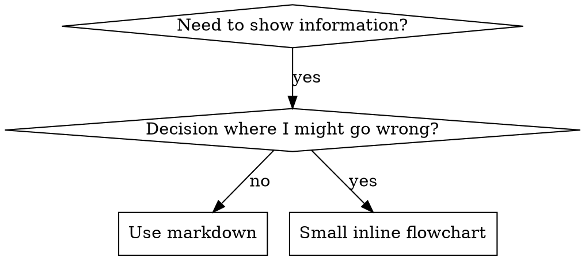

# 编写技能 (Writing Skills)

## 概述

**编写技能就是应用于流程文档的测试驱动开发 (TDD)。**

**个人技能位于特定于代理的目录中（Claude Code 为 `~/.claude/skills`，Codex 为 `~/.codex/skills`）**

你编写测试用例（使用子代理的压力场景），观察它们失败（基线行为），编写技能（文档），观察测试通过（代理遵守），并重构（堵塞漏洞）。

**核心原则：** 如果你没有看到代理在没有技能的情况下失败，你就不知道该技能是否教导了正确的事情。

**必需背景：** 在使用此技能之前，你必须了解 superpowers:test-driven-development。该技能定义了基本的红-绿-重构循环。此技能将 TDD 调整为适用于文档。

**官方指南：** 有关 Anthropic 的官方技能编写最佳实践，请参阅 anthropic-best-practices.md。该文档提供了补充此技能中以 TDD 为重点的方法的额外模式和指南。

## 什么是技能？

**技能** 是经过验证的技术、模式或工具的参考指南。技能帮助未来的 Claude 实例找到并应用有效的方法。

**技能是：** 可重用的技术、模式、工具、参考指南

**技能不是：** 关于你曾经如何解决问题的叙述

## 技能的 TDD 映射

| TDD 概念 | 技能创建 |
|-------------|----------------|
| **测试用例** | 使用子代理的压力场景 |
| **生产代码** | 技能文档 (SKILL.md) |
| **测试失败 (红)** | 代理在没有技能的情况下违反规则（基线） |
| **测试通过 (绿)** | 代理在有技能的情况下遵守规则 |
| **重构** | 在保持合规性的同时堵塞漏洞 |
| **先写测试** | 在编写技能之前运行基线场景 |
| **观察其失败** | 准确记录代理使用的合理化借口 |
| **最小代码** | 编写解决这些特定违规行为的技能 |
| **观察其通过** | 验证代理现在是否遵守 |
| **重构循环** | 发现新的合理化借口 → 堵塞 → 重新验证 |

整个技能创建过程遵循红-绿-重构。

## 何时创建技能

**在以下情况下创建：**
- 技术对你来说不是直观显而易见的
- 你会在跨项目中再次引用它
- 模式广泛适用（非特定于项目）
- 其他人会受益

**不要为以下情况创建：**
- 一次性解决方案
- 在其他地方已有记录的标准做法
- 特定于项目的约定（放入 CLAUDE.md）
- 机械约束（如果可以通过正则表达式/验证强制执行，请自动化它——将文档留给判断调用）

## 技能类型

### 技术 (Technique)
具有要遵循的步骤的具体方法（基于条件的等待，根本原因追踪）

### 模式 (Pattern)
思考问题的方式（使用标志扁平化，测试不变量）

### 参考 (Reference)
API 文档，语法指南，工具文档（办公文档）

## 目录结构

```
skills/
  skill-name/
    SKILL.md              # 主要参考（必需）
    supporting-file.*     # 仅在该需要时
```

**扁平命名空间** - 所有技能都在一个可搜索的命名空间中

**单独的文件用于：**
1. **大量参考** (100+ 行) - API 文档，全面的语法
2. **可重用工具** - 脚本，实用程序，模板

**保持内联：**
- 原则和概念
- 代码模式 (< 50 行)
- 其他所有内容

## SKILL.md 结构

**Frontmatter (YAML):**
- 仅支持两个字段：`name` 和 `description`
- 总共最多 1024 个字符
- `name`: 仅使用字母、数字和连字符（无括号、特殊字符）
- `description`: 第三人称，仅描述何时使用（而不是它做什么）
  - 以 "Use when..." 开头，专注于触发条件
  - 包括具体的症状、情况和上下文
  - **绝不总结技能的过程或工作流**（参见 CSO 部分了解原因）
  - 如果可能，保持在 500 个字符以内

```markdown
---
name: Skill-Name-With-Hyphens
description: Use when [specific triggering conditions and symptoms]
---

# Skill Name

## Overview
这是什么？1-2 句话的核心原则。

## When to Use
[如果决策不明显，使用小型内联流程图]

带有症状和用例的项目符号列表
何时不使用

## Core Pattern (用于技术/模式)
代码比较之前/之后

## Quick Reference
用于扫描常见操作的表格或项目符号

## Implementation
简单模式的内联代码
链接到文件以获大量参考或可重用工具

## Common Mistakes
什么会出错 + 修复

## Real-World Impact (可选)
具体结果
```

## Claude 搜索优化 (CSO)

**发现的关键：** 未来的 Claude 需要找到你的技能

### 1. 丰富的描述字段

**目的：** Claude 阅读描述以决定为给定任务加载哪些技能。让它回答：“我现在应该阅读这个技能吗？”

**格式：** 以 "Use when..." 开头，专注于触发条件

**关键：描述 = 何时使用，而不是技能做什么**

描述应仅描述触发条件。不要在描述中总结技能的过程或工作流。

**为什么这很重要：** 测试显示，当描述总结技能的工作流时，Claude 可能会遵循描述而不是阅读完整的技能内容。一个说“任务之间进行代码审查”的描述导致 Claude 只做了一次审查，即使技能的流程图清楚地显示了两次审查（先是规范合规性，然后是代码质量）。

当描述更改为仅“Use when executing implementation plans with independent tasks”（无工作流摘要）时，Claude 正确读取了流程图并遵循了两阶段审查过程。

**陷阱：** 总结工作流的描述会创建一个 Claude 会采取的捷径。技能正文变成 Claude 跳过的文档。

```yaml
# ❌ BAD: 总结工作流 - Claude 可能会遵循此而不是阅读技能
description: Use when executing plans - dispatches subagent per task with code review between tasks

# ❌ BAD: 太多过程细节
description: Use for TDD - write test first, watch it fail, write minimal code, refactor

# ✅ GOOD: 仅触发条件，无工作流摘要
description: Use when executing implementation plans with independent tasks in the current session

# ✅ GOOD: 仅触发条件
description: Use when implementing any feature or bugfix, before writing implementation code
```

**内容：**
- 使用具体的触发器、症状和情况，表明此技能适用
- 描述 *问题*（竞争条件，不一致的行为）而不是 *特定于语言的症状* (setTimeout, sleep)
- 除非技能本身是特定于技术的，否则保持触发器与技术无关
- 如果技能是特定于技术的，请在触发器中明确说明
- 用第三人称写（注入到系统提示中）
- **绝不总结技能的过程或工作流**

```yaml
# ❌ BAD: 太抽象，模糊，不包括何时使用
description: For async testing

# ❌ BAD: 第一人称
description: I can help you with async tests when they're flaky

# ❌ BAD: 提及技术但技能并非特定于它
description: Use when tests use setTimeout/sleep and are flaky

# ✅ GOOD: 以 "Use when" 开头，描述问题，无工作流
description: Use when tests have race conditions, timing dependencies, or pass/fail inconsistently

# ✅ GOOD: 具有明确触发器的特定于技术的技能
description: Use when using React Router and handling authentication redirects
```

### 2. 关键词覆盖

使用 Claude 会搜索的词：
- 错误消息: "Hook timed out", "ENOTEMPTY", "race condition"
- 症状: "flaky", "hanging", "zombie", "pollution"
- 同义词: "timeout/hang/freeze", "cleanup/teardown/afterEach"
- 工具: 实际命令，库名称，文件类型

### 3. 描述性命名

**使用主动语态，动词优先：**
- ✅ `creating-skills` 不是 `skill-creation`
- ✅ `condition-based-waiting` 不是 `async-test-helpers`

### 4. Token 效率 (关键)

**问题：** getting-started 和频繁引用的技能会加载到每个对话中。每个 token 都有用。

**目标字数：**
- getting-started 工作流: 每个 <150 字
- 频繁加载的技能: 总共 <200 字
- 其他技能: <500 字（仍需简洁）

**技术：**

**将详细信息移至工具帮助：**
```bash
# ❌ BAD: 在 SKILL.md 中记录所有标志
search-conversations supports --text, --both, --after DATE, --before DATE, --limit N

# ✅ GOOD: 引用 --help
search-conversations supports multiple modes and filters. Run --help for details.
```

**使用交叉引用：**
```markdown
# ❌ BAD: 重复工作流细节
When searching, dispatch subagent with template...
[20 lines of repeated instructions]

# ✅ GOOD: 引用其他技能
Always use subagents (50-100x context savings). REQUIRED: Use [other-skill-name] for workflow.
```

**压缩示例：**
```markdown
# ❌ BAD: 冗长的示例 (42 words)
your human partner: "How did we handle authentication errors in React Router before?"
You: I'll search past conversations for React Router authentication patterns.
[Dispatch subagent with search query: "React Router authentication error handling 401"]

# ✅ GOOD: 最小示例 (20 words)
Partner: "How did we handle auth errors in React Router?"
You: Searching...
[Dispatch subagent → synthesis]
```

**消除冗余：**
- 不要重复交叉引用的技能中的内容
- 不要解释命令中显而易见的内容
- 不要包含同一模式的多个示例

**验证：**
```bash
wc -w skills/path/SKILL.md
# getting-started workflows: aim for <150 each
# Other frequently-loaded: aim for <200 total
```

**按照你做什么或核心见解命名：**
- ✅ `condition-based-waiting` > `async-test-helpers`
- ✅ `using-skills` 优于 `skill-usage`
- ✅ `flatten-with-flags` > `data-structure-refactoring`
- ✅ `root-cause-tracing` > `debugging-techniques`

**动名词 (-ing) 非常适合过程：**
- `creating-skills`, `testing-skills`, `debugging-with-logs`
- 主动，描述你正在采取的行动

### 4. 交叉引用其他技能

**在编写引用其他技能的文档时：**

仅使用技能名称，带有明确的需求标记：
- ✅ Good: `**REQUIRED SUB-SKILL:** Use superpowers:test-driven-development`
- ✅ Good: `**REQUIRED BACKGROUND:** You MUST understand superpowers:systematic-debugging`
- ❌ Bad: `See skills/testing/test-driven-development` (不清楚是否必需)
- ❌ Bad: `@skills/testing/test-driven-development/SKILL.md` (强制加载，消耗上下文)

**为什么没有 @ 链接：** `@` 语法立即强制加载文件，在你需要它们之前消耗 200k+ 上下文。

## 流程图使用



**仅将流程图用于：**
- 非明显的决策点
- 你可能会过早停止的过程循环
- "何时使用 A vs B" 的决策

**绝不要将流程图用于：**
- 参考材料 → 表格，列表
- 代码示例 → Markdown 块
- 线性指令 → 编号列表
- 没有语义意义的标签 (step1, helper2)

请参阅 @graphviz-conventions.dot 了解 graphviz 样式规则。

**为你的合作伙伴可视化：** 使用此目录中的 `render-graphs.js` 将技能的流程图渲染为 SVG：
```bash
./render-graphs.js ../some-skill           # Each diagram separately
./render-graphs.js ../some-skill --combine # All diagrams in one SVG
```

## 代码示例

**一个优秀的示例胜过许多平庸的示例**

选择最相关的语言：
- 测试技术 → TypeScript/JavaScript
- 系统调试 → Shell/Python
- 数据处理 → Python

**好的示例：**
- 完整且可运行
- 解释为什么的注释良好
- 来自真实场景
- 清楚地显示模式
- 准备调整（不是通用模板）

**不要：**
- 在 5+ 种语言中实现
- 创建填空模板
- 编写人为的示例

你擅长移植 - 一个伟大的例子就足够了。

## 文件组织

### 自包含技能
```
defense-in-depth/
  SKILL.md    # 一切内联
```
适用情况：所有内容都适合，不需要大量参考

### 带有可重用工具的技能
```
condition-based-waiting/
  SKILL.md    # 概述 + 模式
  example.ts  # 工作的助手以适应
```
适用情况：工具是可重用的代码，不仅仅是叙述

### 带有大量参考的技能
```
pptx/
  SKILL.md       # 概述 + 工作流
  pptxgenjs.md   # 600 行 API 参考
  ooxml.md       # 500 行 XML 结构
  scripts/       # 可执行工具
```
适用情况：参考材料对于内联来说太大了

## 铁律 (与 TDD 相同)

```
NO SKILL WITHOUT A FAILING TEST FIRST
```

这适用于 **新** 技能和 **编辑** 现有技能。

在测试之前写技能？删除它。重新开始。
在没有测试的情况下编辑技能？同样的违规。

**没有例外：**
- 不适用于“简单的添加”
- 不适用于“只是添加一个部分”
- 不适用于“文档更新”
- 不要将未经测试的更改保留为“参考”
- 尽量不要在运行测试时“适应”
- 删除意味着删除

**必需背景：** superpowers:test-driven-development 技能解释了为什么这很重要。同样的原则适用于文档。

## 测试所有技能类型

不同的技能类型需要不同的测试方法：

### 纪律执行技能 (规则/要求)

**示例：** TDD, verification-before-completion, designing-before-coding

**测试方法：**
- 学术问题：他们理解规则吗？
- 压力场景：他们在压力下遵守吗？
- 多重压力组合：时间 + 沉没成本 + 疲惫
- 识别合理化借口并添加明确的反击

**成功标准：** 代理在最大压力下遵循规则

### 技术技能 (操作指南)

**示例：** condition-based-waiting, root-cause-tracing, defensive-programming

**测试方法：**
- 应用场景：他们能正确应用技术吗？
- 变体场景：他们处理边缘情况吗？
- 缺失信息测试：说明有空白吗？

**成功标准：** 代理成功将技术应用于新场景

### 模式技能 (心智模型)

**示例：** reducing-complexity, information-hiding concepts

**测试方法：**
- 识别场景：他们能在模式适用时识别吗？
- 应用场景：他们能使用心智模型吗？
- 反例：他们知道何时 **不** 应用吗？

**成功标准：** 代理正确识别何时/如何应用模式

### 参考技能 (文档/APIs)

**示例：** API 文档，命令参考，库指南

**测试方法：**
- 检索场景：他们能找到正确的信息吗？
- 应用场景：他们能正确使用找到的信息吗？
- 差距测试：涵盖了常见的用例吗？

**成功标准：** 代理找到并正确应用参考信息

## 跳过测试的常见合理化借口

| 借口 | 现实 |
|--------|---------|
| "技能显然很清楚" | 对你清楚 ≠ 对其他代理清楚。测试它。 |
| "它只是一个参考" | 参考可能有空白，不清楚的部分。测试检索。 |
| "测试是过度杀伤" | 未经测试的技能有问题。总是。15 分钟测试节省数小时。 |
| "如果出现问题我会测试" | 问题 = 代理无法使用技能。在部署 **之前** 测试。 |
| "测试太繁琐" | 测试比在生产中调试糟糕的技能不那么繁琐。 |
| "我相信它是好的" | 过度自信保证有问题。无论如何都要测试。 |
| "学术审查足够了" | 阅读 ≠ 使用。测试应用场景。 |
| "没有时间测试" | 部署未经测试的技能会在以后浪费更多时间修复它。 |

**所有这些意味着：在部署之前测试。没有例外。**

## 防止技能被合理化借口攻击

执行纪律（如 TDD）的技能需要抵制合理化。代理很聪明，在压力下会寻找漏洞。

**心理学注：** 了解 **为什么** 说服技术起作用有助于你系统地应用它们。参见 persuasion-principles.md 了解关于权威、承诺、稀缺性、社会证明和统一原则的研究基础 (Cialdini, 2021; Meincke et al., 2025)。

### 明确堵塞每个漏洞

不要只陈述规则 - 禁止具体的变通方法：

<Bad>
```markdown
Write code before test? Delete it.
```
</Bad>

<Good>
```markdown
Write code before test? Delete it. Start over.

**No exceptions:**
- Don't keep it as "reference"
- Don't "adapt" it while writing tests
- Don't look at it
- Delete means delete
```
</Good>

### 解决 "精神 vs 字面" 的争论

尽早添加基本原则：

```markdown
**Violating the letter of the rules is violating the spirit of the rules.**
```

这切断了整个类别的“我遵循精神”的合理化。

### 建立合理化表

从基线测试（见下面的测试部分）中捕获合理化。代理的每一个借口都会进入表格：

```markdown
| Excuse | Reality |
|--------|---------|
| "Too simple to test" | Simple code breaks. Test takes 30 seconds. |
| "I'll test after" | Tests passing immediately prove nothing. |
| "Tests after achieve same goals" | Tests-after = "what does this do?" Tests-first = "what should this do?" |
```

### 创建红旗列表

让代理在合理化时轻松自查：

```markdown
## Red Flags - STOP and Start Over

- Code before test
- "I already manually tested it"
- "Tests after achieve the same purpose"
- "It's about spirit not ritual"
- "This is different because..."

**All of these mean: Delete code. Start over with TDD.**
```

### 更新 CSO 以获取违规症状

添加到描述：当你即将违反规则时的症状：

```yaml
description: use when implementing any feature or bugfix, before writing implementation code
```

## 技能的 RED-GREEN-REFACTOR

遵循 TDD 循环：

### 红: 编写失败的测试 (基线)

在 **没有** 技能的情况下使用子代理运行压力场景。记录确切的行为：
- 他们做出了什么选择？
- 他们使用了什么合理化借口（逐字）？
- 哪些压力触发了违规？

这是“观察测试失败”——你必须在编写技能之前看到代理自然会做什么。

### 绿: 编写最小技能

编写解决这些特定合理化借口的技能。不要为假设情况添加额外内容。

使用技能运行相同的场景。代理现在应该遵守。

### 重构: 堵塞漏洞

代理发现了新的合理化借口？添加明确的反击。重新测试直到防弹。

**测试方法：** 参见 @testing-skills-with-subagents.md 了解完整的测试方法：
- 如何编写压力场景
- 压力类型（时间，沉没成本，权威，疲惫）
- 系统地堵塞漏洞
- 元测试技术

## 反模式

### ❌ 叙述性示例
"In session 2025-10-03, we found empty projectDir caused..."
**为什么不好：** 太具体，不可重用

### ❌ 多语言稀释
example-js.js, example-py.py, example-go.go
**为什么不好：** 质量平庸，维护负担

### ❌ 流程图中的代码
```dot
step1 [label="import fs"];
step2 [label="read file"];
```
**为什么不好：** 无法复制粘贴，难以阅读

### ❌ 通用标签
helper1, helper2, step3, pattern4
**为什么不好：** 标签应具有语义意义

## 停止：在移动到下一个技能之前

**编写任何技能后，你必须停止并完成部署过程。**

**不要：**
- 在没有测试每个技能的情况下批量创建多个技能
- 在当前技能验证之前移动到下一个技能
- 仅仅因为“批处理更有效”而跳过测试

**下面的部署清单对于每个技能都是强制性的。**

部署未经测试的技能 = 部署未经测试的代码。这违反了质量标准。

## 技能创建清单 (TDD 适应版)

**重要：使用 TodoWrite 为下面的每个清单项目创建待办事项。**

**红阶段 - 编写失败的测试：**
- [ ] 创建压力场景（纪律技能 3+ 组合压力）
- [ ] 在没有技能的情况下运行场景 - 逐字记录基线行为
- [ ] 识别合理化/失败的模式

**绿阶段 - 编写最小技能：**
- [ ] 名称仅使用字母、数字、连字符（无括号/特殊字符）
- [ ] YAML frontmatter 仅包含名称和描述（最多 1024 个字符）
- [ ] 描述以 "Use when..." 开头，并包括具体的触发器/症状
- [ ] 描述用第三人称写
- [ ] 关键词贯穿始终以便搜索（错误、症状、工具）
- [ ] 清晰的概述和核心原则
- [ ] 解决在红阶段识别的具体基线失败
- [ ] 内联代码或链接到单独文件
- [ ] 一个优秀的示例（非多语言）
- [ ] **语言规则：** `SKILL.md` 必须是英文。
- [ ] **必需子技能 (REQUIRED SUB-SKILL)：** 使用 `bilingual_docs` 技能自动创建/更新中文版本 (`SKILL.zh.md`) 并确保其保持同步。
- [ ] **需求分析：** 在设计技能之前，识别 3 个关于技能需求和用户的“跨度大”且“有深度”的问题。**这些问题必须用中文提问**。在回答这些问题之前不要继续。
- [ ] 使用技能运行场景 - 验证代理现在是否遵守

**重构阶段 - 堵塞漏洞：**
- [ ] 从测试中识别新的合理化借口
- [ ] 添加明确的反击（如果是纪律技能）
- [ ] 从所有测试迭代中建立合理化表
- [ ] 创建红旗列表
- [ ] 重新测试直到防弹

**质量检查：**
- [ ] 仅在决策不明显时使用小型流程图
- [ ] 快速参考表
- [ ] 常见错误部分
- [ ] 没有叙述性讲故事
- [ ] 支持文件仅用于工具或大量参考

**部署：**
- [ ] 提交技能到 git 并推送到你的分支（如果已配置）
- [ ] 考虑通过 PR 贡献回来（如果广泛有用）

## 发现工作流

未来的 Claude 如何找到你的技能：

1. **遇到问题** ("tests are flaky")
3. **找到 SKILL** (描述匹配)
4. **浏览概述** (这相关吗？)
5. **阅读模式** (快速参考表)
6. **加载示例** (仅在实施时)

**为此流程优化** - 尽早并经常放置可搜索的术语。

## 底线

**创建技能就是流程文档的 TDD。**

同样的铁律：没有先失败的测试就没有技能。
同样的循环：红 (基线) → 绿 (编写技能) → 重构 (堵塞漏洞)。
同样的好处：更好的质量，更少的意外，防弹的结果。

如果你对代码遵循 TDD，请对技能遵循它。这是适用于文档的相同纪律。
